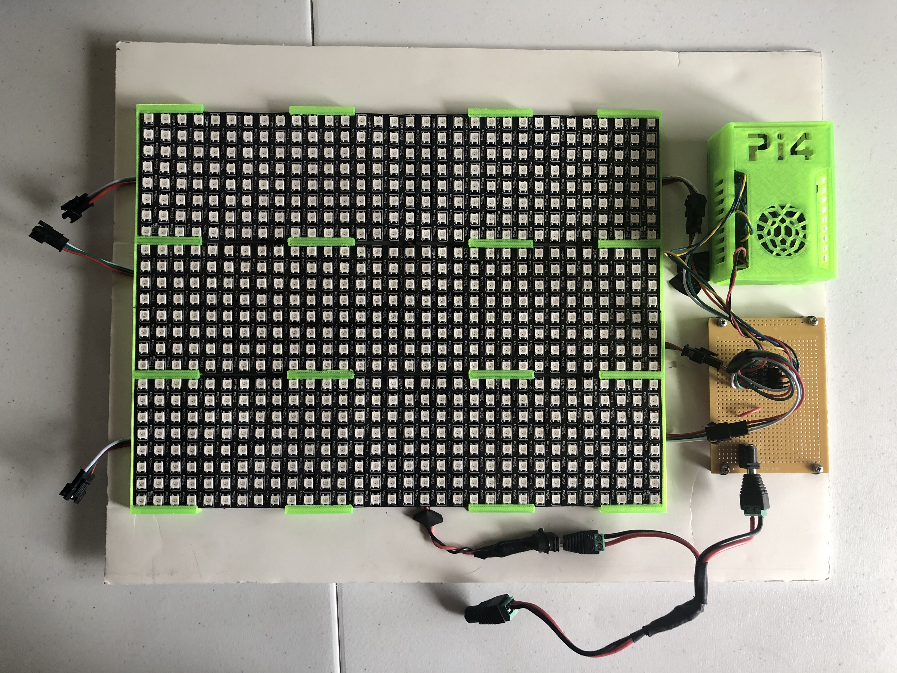

# RPi-LED-Strings

![Project Maintenance][maintenance-shield]

[![GitHub Activity][commits-shield]][commits]

An RPi Linux LKM and Demo Application for driving three WS2812B panels via GPIO

The three panels are organized as 24x32 pixels (768 pixels.) The panels are driven in parallel (3 chains of 256 LEDs.)

Goal: learn how far we could go with fairly precise bit timings via GPIO. What's in our way with a non-realtime kernel?  How much can we control to move things out of our way?  Etc.

The end result so far:

- Working LKM (Loadable Kernal Module)
- Removed a core (1of4) from the scheduler and allocated it to running our driver
- Control the RPi clock speed transitions so that we have a predictable system clock
- Implemented conversion code from .bmp to the panel organization so we can load and display images
- The three panels are organized as 24x32 pixels (768 pixels)
- Drive the GPIO signals so that we can paint this 24x32 matrix at 120 fps
- This is a 3 x 256 pixel driver which can likely go to 8 x 256 with no loss in timing

## Hardware Set Up

I 3D printed clips for the 3 panels and then mounted everything on a foam/paper presentation board. The RPI4 i'm using is in a 3d printed case and cooled with a fan. The GPIOs are wire to 3.3v to 5v level shifters which are then wired to each of the three panels.  A separate connector is provided for the 10A 5v power supply. (*Yep, these LEDs draw a lot of power!*)  Here's what my hardware set up looks like:

### Wiring

Here's the pinout I use:

| Purpose | Raspberry Pi Pin |
|------------|------------------|
| GND        | 9 (Ground) |
| VCC        | 1 (3.3v) |
| Top Panel    | 11 (GPIO 17) |
| Middle Panel       | 13 (GPIO 27) |
| Bottom Panel | 15 (GPIO 22) |

(*wiring schematic TBD* - *but easy to figure out*)

### 3D Printed things

The RPi case I printed can be found at [ThingVerse](https://www.thingiverse.com/thing:3717401)

The brackets I printed I have not yet uploaded to ThingVerse but email me if you'd like the STLs which I designed using my favorite 3D design tool [Shapr3D for iPad Pro](https://www.shapr3d.com/). 

### Verifying performance

I use the [SQ200 from ikalogic.com](https://www.ikalogic.com/sq-logic-analyzer-pattern-generator/) Inexpensive ~$175 Logic Analyzer / Pattern Generator. It comes with ScanaStudio software which automatically decodes most protocols I use in my play/work efforts.  (*Yes, it even decodes the WS2812B protocol!*)  If you know me, you know that I spent years on a largescale logic analyzer development team. It's hard for me to be happy with Logic Analyzer software / capabiliteis as i'm a bit more critical but this one has me smiling every time I use it!.  And the protocols are open source!

## Here in this repo

See [./LEDfifoLKM](LEDfifoLKM) for working project driver

See [./prototypes/](prototypes) for my initial projects as I awakened this hardware

## References

[LKM Book](https://lwn.net/Kernel/LDD3/) - Favorite reference/guide for writing the LKM

[Building C/C++ apps on RPi](https://help.ubuntu.com/community/CompilingEasyHowTo) - Setting up to build our LKM

[Isolating Cores](https://yosh.ke.mu/raspberry_pi_isolating_cores_in_linux_kernel) - Isolating a core to run our driver

[Kernel Parameters](https://github.com/raspberrypi/linux/blob/rpi-3.2.27/Documentation/kernel-parameters.txt) - Reference

[Overclocking](https://www.raspberrypi.org/documentation/configuration/config-txt/overclocking.md) - controlling CPU throtteling 

[config.txt](https://www.raspberrypi.org/documentation/configuration/config-txt/README.md) - more setup info

### Lesser Used

[Broadcom BCM2385 Spec](http://www.raspberrypi.org/wp-content/uploads/2012/02/BCM2835-ARM-Peripherals.pdf) - main peripheral I/C for Raspberry Pi

----

## Disclaimer and Legal

> *Raspberry Pi* is registered trademark of *Raspberry Pi (Trading) Ltd.*
>
> This project is a community project not for commercial use.
>
> This project is in no way affiliated with, authorized, maintained, sponsored or endorsed by *Raspberry Pi (Trading) Ltd.* or any of its affiliates or subsidiaries.

-

### [Copyright](copyright) | [License](LICENSE)

[commits-shield]: https://img.shields.io/github/commit-activity/y/ironsheep/RPi-LED-Strings.svg?style=for-the-badge
[commits]: https://github.com/ironsheep/RPi-LED-Strings/commits/master

[license-shield]: https://img.shields.io/github/license/ironsheep/RPi-LED-Strings.svg?style=for-the-badge

[maintenance-shield]: https://img.shields.io/badge/maintainer-S%20M%20Moraco%20%40ironsheepbiz-blue.svg?style=for-the-badge

[releases-shield]: https://img.shields.io/github/release/ironsheep/RPi-LED-Strings.svg?style=for-the-badge
[releases]: https://github.com/ironsheep/RPi-LED-Strings/releases

